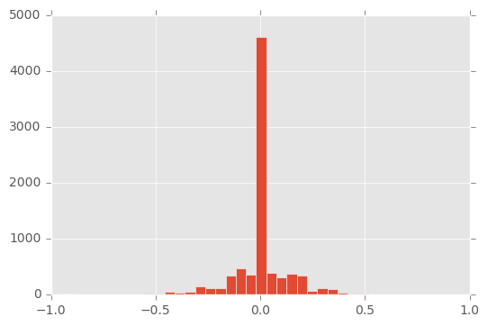
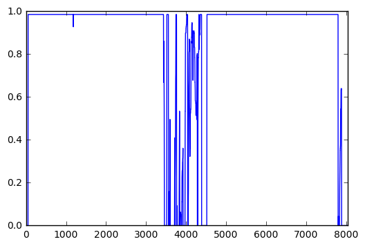
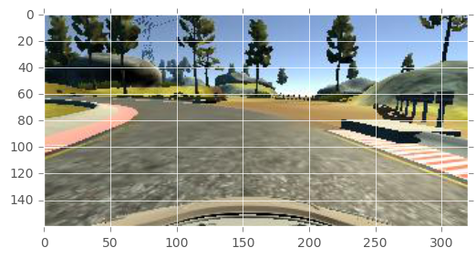
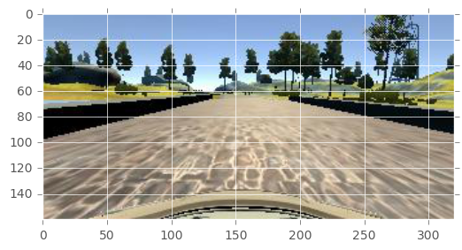
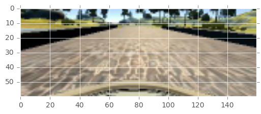
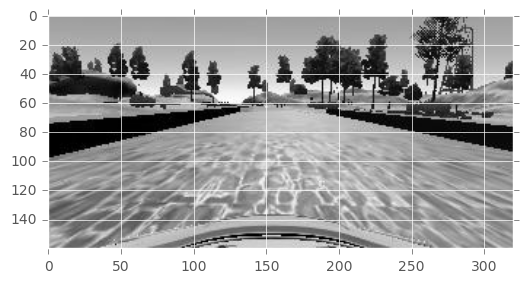
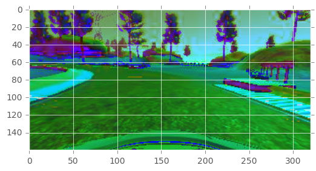
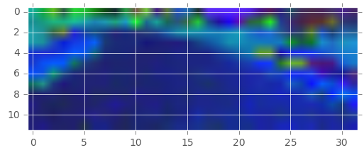

```python
import cv2
import matplotlib.pyplot as plt
import matplotlib.image as img
%matplotlib inline
import pandas as pd
import matplotlib
matplotlib.style.use('ggplot')
```


```python
df = pd.read_csv('data/driving_log.csv')
```


```python
df.head()
```


<div>
<table border="1" class="dataframe">
  <thead>
    <tr style="text-align: right;">
      <th></th>
      <th>center</th>
      <th>left</th>
      <th>right</th>
      <th>steering</th>
      <th>throttle</th>
      <th>brake</th>
      <th>speed</th>
    </tr>
  </thead>
  <tbody>
    <tr>
      <th>0</th>
      <td>IMG/center_2016_12_01_13_30_48_287.jpg</td>
      <td>IMG/left_2016_12_01_13_30_48_287.jpg</td>
      <td>IMG/right_2016_12_01_13_30_48_287.jpg</td>
      <td>0.0</td>
      <td>0.0</td>
      <td>0.0</td>
      <td>22.148290</td>
    </tr>
    <tr>
      <th>1</th>
      <td>IMG/center_2016_12_01_13_30_48_404.jpg</td>
      <td>IMG/left_2016_12_01_13_30_48_404.jpg</td>
      <td>IMG/right_2016_12_01_13_30_48_404.jpg</td>
      <td>0.0</td>
      <td>0.0</td>
      <td>0.0</td>
      <td>21.879630</td>
    </tr>
    <tr>
      <th>2</th>
      <td>IMG/center_2016_12_01_13_31_12_937.jpg</td>
      <td>IMG/left_2016_12_01_13_31_12_937.jpg</td>
      <td>IMG/right_2016_12_01_13_31_12_937.jpg</td>
      <td>0.0</td>
      <td>0.0</td>
      <td>0.0</td>
      <td>1.453011</td>
    </tr>
    <tr>
      <th>3</th>
      <td>IMG/center_2016_12_01_13_31_13_037.jpg</td>
      <td>IMG/left_2016_12_01_13_31_13_037.jpg</td>
      <td>IMG/right_2016_12_01_13_31_13_037.jpg</td>
      <td>0.0</td>
      <td>0.0</td>
      <td>0.0</td>
      <td>1.438419</td>
    </tr>
    <tr>
      <th>4</th>
      <td>IMG/center_2016_12_01_13_31_13_177.jpg</td>
      <td>IMG/left_2016_12_01_13_31_13_177.jpg</td>
      <td>IMG/right_2016_12_01_13_31_13_177.jpg</td>
      <td>0.0</td>
      <td>0.0</td>
      <td>0.0</td>
      <td>1.418236</td>
    </tr>
  </tbody>
</table>
</div>


```python
df.info()
```

    <class 'pandas.core.frame.DataFrame'>
    RangeIndex: 8036 entries, 0 to 8035
    Data columns (total 7 columns):
    center      8036 non-null object
    left        8036 non-null object
    right       8036 non-null object
    steering    8036 non-null float64
    throttle    8036 non-null float64
    brake       8036 non-null float64
    speed       8036 non-null float64
    dtypes: float64(4), object(3)
    memory usage: 439.5+ KB


```python
df[df.steering > 0].count()
```


    center      1900
    left        1900
    right       1900
    steering    1900
    throttle    1900
    brake       1900
    speed       1900
    dtype: int64


```python
df.steering.hist(bins=40)
```


    <matplotlib.axes._subplots.AxesSubplot at 0x10f9131d0>





```python
df.speed.hist()
```


    <matplotlib.axes._subplots.AxesSubplot at 0x10ec8c128>


```python
df.throttle.plot()
```


    <matplotlib.axes._subplots.AxesSubplot at 0x10da0df28>





```python
from PIL import Image

data = img.imread('sample/IMG/center_2016_12_01_13_31_13_584.jpg')
plt.imshow(data)
plt.show()
flipped = cv2.flip(data, 1)
plt.imshow(flipped)


```





    <matplotlib.image.AxesImage at 0x10db3a940>


```python
import numpy as np
data = img.imread('sample/IMG/center_2016_12_01_13_30_48_404.jpg')
print(data.shape)
plt.imshow(data)
plt.show()
cropped = data[40:160,:,:]
plt.imshow(cropped)
plt.show(
resized = cv2.resize(cropped, (160, 60), interpolation = cv2.INTER_AREA)
plt.imshow(resized)

plt.show()
s = Image.open('sample/IMG/center_2016_12_01_13_30_48_404.jpg')
s= s.crop((0, 40, 320, 160))
s.thumbnail((160, 60), Image.ANTIALIAS)
plt.imshow(s)

```

    (160, 320, 3)








    <matplotlib.image.AxesImage at 0x1138d0a20>


```python
data = img.imread('sample/IMG/center_2016_12_01_13_30_48_404.jpg')
grayed = cv2.cvtColor(data, cv2.COLOR_RGB2GRAY)
plt.imshow(grayed, cmap='gray')
```


    <matplotlib.image.AxesImage at 0x113da5eb8>





```python
data = img.imread('sample/IMG/center_2016_12_01_13_31_12_937.jpg')
grayed = cv2.cvtColor(data, cv2.COLOR_RGB2HLS)
plt.imshow(grayed, cmap='hsv')

```


    <matplotlib.image.AxesImage at 0x114b0b240>





```python
def preprocess(image):
  img_shape = image.shape
  height = image.shape[0]
  width = image.shape[1]
  cropped = image[50:140,:,:]
  #resized = cv2.resize(cropped, (int(width/5), int((height-40)/5)))
  resized = cv2.resize(cropped, (32, 12))
  resized = cv2.cvtColor(resized, cv2.COLOR_RGB2HSV)
  return resized

data = img.imread('sample/IMG/center_2016_12_01_13_31_12_937.jpg')
grayed = preprocess(data)
plt.imshow(grayed)
grayed.shape
    
```


    (12, 32, 3)




