### Preprocessing & Augmentation

Dataset provided by Udacity has set of 3 images and along with steering angle.

#### Augmentation Mechanism

   * Center Image
      * Convert the image to HSV of size (200, 66)
      * Flip the image and the steering angle
   * Left & Right Image
      * Adjust the left image by adding 0.3 (correction angle) and follow the same steps for center image
      * Adjust the right image by subtracting 0.3(correction angle) and follow the same steps for center image
   * Normalize the image to have values between 0 and 1.   


### Models Exploration

After reading through multiple blogs, slack and Udacity forums. I started with the nvidia model but apparently other members got to drive on both the tracks using a smaller network.

Modified Nvidia network:

```
  image_model = Sequential()
  image_model.add(Convolution2D(24, 5, 5, subsample=(2,2), border_mode='valid', input_shape=input_shape))
  image_model.add(ELU())
  image_model.add(Convolution2D(36, 5, 5, subsample=(2,2), border_mode='valid', input_shape=input_shape))
  image_model.add(ELU())
  image_model.add(Convolution2D(64, 3, 3, subsample=(1,1), border_mode='valid', input_shape=input_shape))
  image_model.add(ELU())
  image_model.add(Convolution2D(96, 3, 3, subsample=(1,1), border_mode='valid', input_shape=input_shape))
  image_model.add(ELU())
  image_model.add(MaxPooling2D(pool_size=(2,2), strides=(1,1)))
  image_model.add(Dropout(0.25))
  image_model.add(Flatten())
  image_model.add(Dense(1024))
  image_model.add(Dense(100))
  image_model.add(Dense(50))
  image_model.add(Dense(1))
  image_model.compile(optimizer='adam', loss='mse')
```

Simpler Network - V1
Reduced the image size to (12, 32, 3) 

```
  image_model = Sequential()
  image_model.add(Convolution2D(64, 3, 3, subsample=(2,2), border_mode='valid', input_shape=input_shape))
  image_model.add(ELU())
  image_model.add(MaxPooling2D(pool_size=(2,2), strides=(1,1)))
  image_model.add(Dropout(0.25))
  image_model.add(Flatten())
  image_model.add(Dense(128))
  image_model.add(Dense(1))
  image_model.compile(optimizer='adam', loss='mse')
```


Simple Network - v2

```
  image_model = Sequential()
  image_model.add(Convolution2D(64, 3, 3, subsample=(2,2), border_mode='valid', input_shape=input_shape))
  image_model.add(ELU())
  image_model.add(MaxPooling2D(pool_size=(2,2), strides=(1,1)))
  image_model.add(Dropout(0.25))
  image_model.add(Flatten())
  image_model.add(Dense(256))
  image_model.add(Dropout(0.25))
  image_model.add(Dense(128))
  image_model.add(Dense(1))
  image_model.compile(optimizer='adam', loss='mse')
```

### Model Architecture: 

Used Adam optimizer default configuration.
Batch Size: 128
Image shape : (12, 32, 3)
Train on 43394 samples, validate on 4822 samples

It's interesting to see how we can reduce the size of the image from (160,320,3) to (12, 32, 3) and still preserve all the necessary information to build 
a working network.

Add MaxPooling to reduce the dimension and Dropout to prevent overfitting.

EDA notebook has some more exploration on the steering angle and the results of the preprocessed images.
 
```
Layer (type)                     Output Shape          Param #     Connected to
====================================================================================================
convolution2d_1 (Convolution2D)  (None, 5, 15, 64)     1792        convolution2d_input_1[0][0]
____________________________________________________________________________________________________
elu_1 (ELU)                      (None, 5, 15, 64)     0           convolution2d_1[0][0]
____________________________________________________________________________________________________
maxpooling2d_1 (MaxPooling2D)    (None, 4, 14, 64)     0           elu_1[0][0]
____________________________________________________________________________________________________
dropout_1 (Dropout)              (None, 4, 14, 64)     0           maxpooling2d_1[0][0]
____________________________________________________________________________________________________
flatten_1 (Flatten)              (None, 3584)          0           dropout_1[0][0]
____________________________________________________________________________________________________
dense_1 (Dense)                  (None, 256)           917760      flatten_1[0][0]
____________________________________________________________________________________________________
dropout_2 (Dropout)              (None, 256)           0           dense_1[0][0]
____________________________________________________________________________________________________
dense_2 (Dense)                  (None, 128)           32896       dropout_2[0][0]
____________________________________________________________________________________________________
dense_3 (Dense)                  (None, 1)             129         dense_2[0][0]
====================================================================================================
Total params: 952577

```

Results

[Video](https://www.youtube.com/watch?v=hRSRT1hJtpI)

### EDA Exploration


```python
import cv2
import matplotlib.pyplot as plt
import matplotlib.image as img
%matplotlib inline
import pandas as pd
import matplotlib
matplotlib.style.use('ggplot')
```


```python
df = pd.read_csv('data/driving_log.csv')
```


```python
df.head()
```


<div>
<table border="1" class="dataframe">
  <thead>
    <tr style="text-align: right;">
      <th></th>
      <th>center</th>
      <th>left</th>
      <th>right</th>
      <th>steering</th>
      <th>throttle</th>
      <th>brake</th>
      <th>speed</th>
    </tr>
  </thead>
  <tbody>
    <tr>
      <th>0</th>
      <td>IMG/center_2016_12_01_13_30_48_287.jpg</td>
      <td>IMG/left_2016_12_01_13_30_48_287.jpg</td>
      <td>IMG/right_2016_12_01_13_30_48_287.jpg</td>
      <td>0.0</td>
      <td>0.0</td>
      <td>0.0</td>
      <td>22.148290</td>
    </tr>
    <tr>
      <th>1</th>
      <td>IMG/center_2016_12_01_13_30_48_404.jpg</td>
      <td>IMG/left_2016_12_01_13_30_48_404.jpg</td>
      <td>IMG/right_2016_12_01_13_30_48_404.jpg</td>
      <td>0.0</td>
      <td>0.0</td>
      <td>0.0</td>
      <td>21.879630</td>
    </tr>
    <tr>
      <th>2</th>
      <td>IMG/center_2016_12_01_13_31_12_937.jpg</td>
      <td>IMG/left_2016_12_01_13_31_12_937.jpg</td>
      <td>IMG/right_2016_12_01_13_31_12_937.jpg</td>
      <td>0.0</td>
      <td>0.0</td>
      <td>0.0</td>
      <td>1.453011</td>
    </tr>
    <tr>
      <th>3</th>
      <td>IMG/center_2016_12_01_13_31_13_037.jpg</td>
      <td>IMG/left_2016_12_01_13_31_13_037.jpg</td>
      <td>IMG/right_2016_12_01_13_31_13_037.jpg</td>
      <td>0.0</td>
      <td>0.0</td>
      <td>0.0</td>
      <td>1.438419</td>
    </tr>
    <tr>
      <th>4</th>
      <td>IMG/center_2016_12_01_13_31_13_177.jpg</td>
      <td>IMG/left_2016_12_01_13_31_13_177.jpg</td>
      <td>IMG/right_2016_12_01_13_31_13_177.jpg</td>
      <td>0.0</td>
      <td>0.0</td>
      <td>0.0</td>
      <td>1.418236</td>
    </tr>
  </tbody>
</table>
</div>


```python
df.info()
```

    <class 'pandas.core.frame.DataFrame'>
    RangeIndex: 8036 entries, 0 to 8035
    Data columns (total 7 columns):
    center      8036 non-null object
    left        8036 non-null object
    right       8036 non-null object
    steering    8036 non-null float64
    throttle    8036 non-null float64
    brake       8036 non-null float64
    speed       8036 non-null float64
    dtypes: float64(4), object(3)
    memory usage: 439.5+ KB


```python
df[df.steering > 0].count()
```


    center      1900
    left        1900
    right       1900
    steering    1900
    throttle    1900
    brake       1900
    speed       1900
    dtype: int64


```python
df.steering.hist(bins=40)
```


    <matplotlib.axes._subplots.AxesSubplot at 0x10f9131d0>


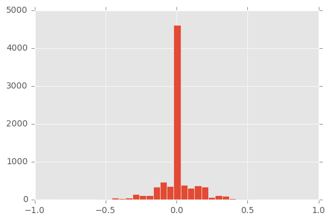


```python
df.speed.hist()
```


    <matplotlib.axes._subplots.AxesSubplot at 0x10ec8c128>


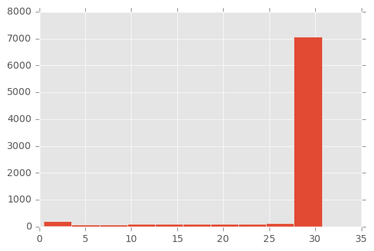


```python
df.throttle.plot()
```


    <matplotlib.axes._subplots.AxesSubplot at 0x10da0df28>


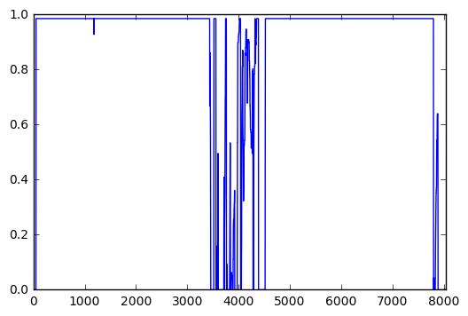


```python
from PIL import Image

data = img.imread('sample/IMG/center_2016_12_01_13_31_13_584.jpg')
plt.imshow(data)
plt.show()
flipped = cv2.flip(data, 1)
plt.imshow(flipped)


```


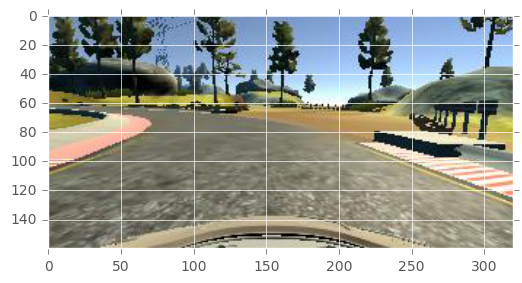


    <matplotlib.image.AxesImage at 0x10db3a940>


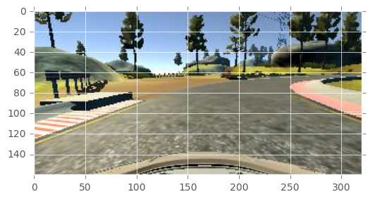


```python
import numpy as np
data = img.imread('sample/IMG/center_2016_12_01_13_30_48_404.jpg')
print(data.shape)
plt.imshow(data)
plt.show()
cropped = data[40:160,:,:]
plt.imshow(cropped)
plt.show(
resized = cv2.resize(cropped, (160, 60), interpolation = cv2.INTER_AREA)
plt.imshow(resized)

plt.show()
s = Image.open('sample/IMG/center_2016_12_01_13_30_48_404.jpg')
s= s.crop((0, 40, 320, 160))
s.thumbnail((160, 60), Image.ANTIALIAS)
plt.imshow(s)

```

    (160, 320, 3)


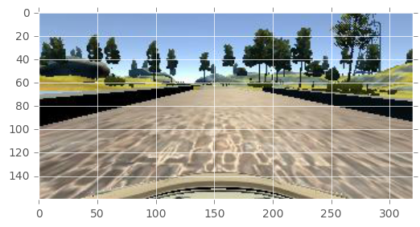


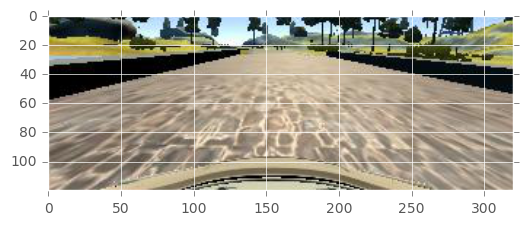


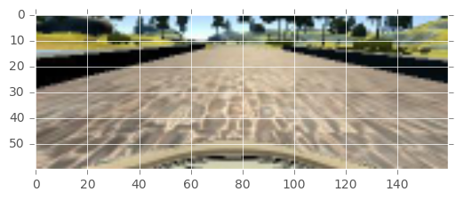


    <matplotlib.image.AxesImage at 0x1138d0a20>


```python
data = img.imread('sample/IMG/center_2016_12_01_13_30_48_404.jpg')
grayed = cv2.cvtColor(data, cv2.COLOR_RGB2GRAY)
plt.imshow(grayed, cmap='gray')
```


    <matplotlib.image.AxesImage at 0x113da5eb8>


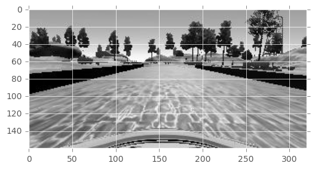


```python
data = img.imread('sample/IMG/center_2016_12_01_13_31_12_937.jpg')
grayed = cv2.cvtColor(data, cv2.COLOR_RGB2HLS)
plt.imshow(grayed, cmap='hsv')

```


    <matplotlib.image.AxesImage at 0x114b0b240>


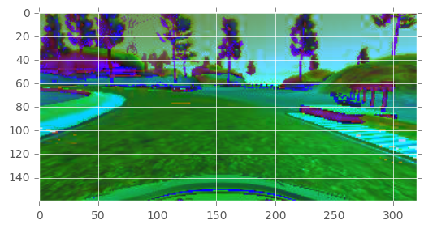


```python
def preprocess(image):
  img_shape = image.shape
  height = image.shape[0]
  width = image.shape[1]
  cropped = image[50:140,:,:]
  #resized = cv2.resize(cropped, (int(width/5), int((height-40)/5)))
  resized = cv2.resize(cropped, (32, 12))
  resized = cv2.cvtColor(resized, cv2.COLOR_RGB2HSV)
  return resized

data = img.imread('sample/IMG/center_2016_12_01_13_31_12_937.jpg')
grayed = preprocess(data)
plt.imshow(grayed)
grayed.shape
    
```


    (12, 32, 3)


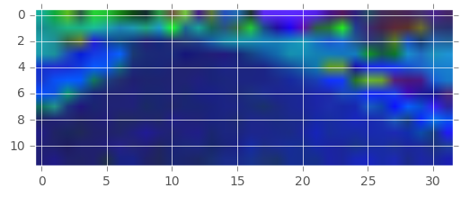


